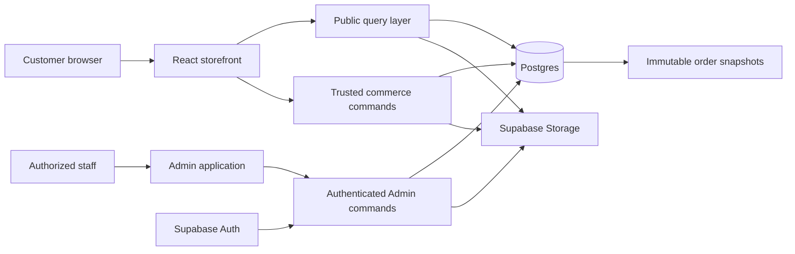

# Luméa Commerce Architecture Lock

**Status:** Approved architecture baseline for Step 9

**Applies to:** Storefront, Admin, catalog, Create Your Bouquet, Cart, Checkout, Orders, Payment, Delivery, and managed site content

**Does not implement:** Supabase, SQL migrations, Auth, Admin UI, Cart, Checkout, payment gateways, or delivery operations

## 1. Decision summary

Luméa is a boutique floral e-commerce platform with a configurable bouquet builder. The homepage may remain editorial, but its business data belongs to the same managed platform as the catalog and order flow.

The locked direction is:

1. **Postgres is the source of truth** for catalog, builder options, mutable site content, carts, orders, payments, delivery rules, and operational status.
2. **Supabase Storage plus media records** is the source of truth for managed files. Application code stores stable media references, not editable image URLs.
3. **The storefront and Admin share one domain model.** Admin changes become visible after a public refresh without a frontend rebuild.
4. **Public React code is a display and interaction client.** It does not authoritatively price an order, authorize Admin actions, or decide fulfillment eligibility.
5. **Trusted order creation revalidates everything** that affects price or fulfillment and writes immutable snapshots for history.
6. **Guest checkout is the V1 default.** Customer accounts remain optional and can be added without redesigning Orders.
7. **Vietnamese and Korean business content uses translation rows.** Stable IDs, canonical slugs, statuses, and relationships remain locale-independent.
8. **Deletion is non-destructive by default.** Published records can be hidden or archived; historical Orders remain readable from snapshots.

Detailed entities, fields, constraints, enums, and relationships are defined in [LUMEA_DATA_MODEL.md](./LUMEA_DATA_MODEL.md). Admin ownership is defined in [LUMEA_ADMIN_SCOPE.md](./LUMEA_ADMIN_SCOPE.md).

## 2. Product Review Gate

1. **Why does this architecture exist?** To let Luméa operate one coherent commerce system instead of adding disconnected frontend features.
2. **Who uses it?** Customers use the storefront and Builder; authorized staff use Admin; engineers use this lock to implement the platform safely.
3. **What is the primary action?** Implement and operate the full Admin → Database/Storage → Storefront → Cart → Order path from one trusted model.
4. **Does the structure support that action?** Yes. The architecture separates public presentation, trusted business operations, persistent domain data, managed media, and historical snapshots.

## 3. Scope and non-goals

### In scope for the architecture

- Ready-made and configurable bouquet products.
- Product variants, occasions, tones, availability, and same-day eligibility.
- Flower stems, wrapping options, and valid wrapping combinations.
- Guest carts, optional future customer ownership, checkout, and Orders.
- Separate buyer, recipient, address, payment, and delivery concerns.
- Admin-managed catalog, Builder, homepage, contact, delivery, and payment content.
- VI/KO data, public/private media, role boundaries, and historical snapshots.
- A migration path from current local data to database-backed repositories.

### Explicit non-goals

- Marketplace, subscription, loyalty, reseller, reviews, or multi-branch architecture.
- Advanced inventory, ingredient reservations, warehouse management, or driver tracking.
- Customer accounts in MVP.
- Card gateway, automated bank reconciliation, or bank webhooks in MVP.
- Drag-and-drop page building or arbitrary executable CMS layouts.
- Implementation of any database, service, API, UI, or integration in Step 8.

## 4. System context

The exact trusted execution mechanism can be a Supabase Edge Function, server endpoint, or security-definer Postgres function. The invariant is more important than the mechanism: privileged writes and final commerce calculations do not run as trusted browser logic.

## 5. Architectural boundaries

### 5.1 Storefront

Responsibilities:

- Render public, published content in VI or KO.
- Collect selections and show responsive price estimates.
- Maintain guest interaction state and call repositories/services.
- Submit cart and checkout commands to a trusted boundary.
- Treat server responses as authoritative for price and fulfillment.

The storefront must never receive a service-role key, unrestricted Admin data, private media paths, or another customer's Order data.

### 5.2 Admin

Responsibilities:

- Manage business-mutable data and media through authenticated commands.
- Enforce valid catalog, Builder, and status transitions.
- Show operational views of Orders, Payment, Delivery, and custom requests.
- Publish, hide, archive, and reorder content without code changes.

Admin UI visibility is not authorization. Every read and mutation is authorized on the trusted data boundary.

### 5.3 Trusted commerce operations

Trusted operations own:

- Product, variant, flower, wrapping, availability, and compatibility validation.
- Same-day, delivery zone, date/window, and fee validation.
- VND integer arithmetic and final totals.
- Idempotent Order creation and human-readable Order number allocation.
- Order, Payment, and Delivery status transitions.
- Snapshot creation and access to protected settings.

### 5.4 Database and Storage

- Postgres stores relational business records, translations, configuration, and snapshots.
- Storage stores binary objects; `media_assets` stores their identity and metadata.
- Public and private media use separate access policies.
- Database foreign keys and checks reject invalid combinations even when the frontend is bypassed.

## 6. Source-of-truth matrix

| Concern | Authoritative source | Consumer notes |
|---|---|---|
| Product, variant, taxonomy, Builder options | Postgres | Storefront receives only published/active fields. |
| Product and homepage images | Storage + `media_assets` | Public delivery may use cached URLs derived from bucket/key. |
| Custom-request reference images | Private Storage + `media_assets` | Signed access for authorized staff only. |
| Interface labels and layout | Versioned React/i18n code | Stable chrome is not business content. |
| VI/KO business copy | Translation tables | Locale fallback is explicit; identity never uses translated text. |
| Cart | Postgres after Cart implementation | A local guest token identifies the server-side cart; localStorage is not final truth. |
| Order and history | Postgres snapshots | Catalog edits never rewrite placed Orders. |
| Payment status | Payment aggregate | Independent from Order status. |
| Delivery status | Delivery aggregate | Independent but coordinated with Order status. |
| Client-calculated total | Not authoritative | Estimate only; trusted order creation recalculates it. |

## 7. Domain boundaries

### Catalog

Owns ready-made, Florist's Choice, and configurable Product identities plus ProductVariant, ProductImage, Category, Occasion, Tone, composition, visibility, availability, and merchandising relations. Visibility and availability are deliberately separate.

### Bouquet Builder

Owns FlowerStem, WrappingOption, WrappingVariant, compatibility, BouquetConfiguration, and BouquetConfigurationItem. The current `BouquetBuilderResult` maps directly to these stable IDs and quantities, but its client prices are inputs for comparison rather than trusted values.

### Cart and Checkout

Owns one Cart and CartItem model for both `READY_MADE` and `CUSTOM_BOUQUET`. Checkout collects buyer, recipient, fulfillment, delivery, card message, and payment choices without requiring an account.

### Order

Owns immutable commercial history: Order, OrderItem, item/configuration snapshots, totals, buyer snapshot, recipient/address snapshot, and status events.

### Payment

Owns method, amount, independent status, references, and the safe subset of payment-setting data shown for that Order. V1 methods are `BANK_TRANSFER` and `CASH`; VietQR is a presentation mechanism for bank transfer, not a third method.

### Delivery

Owns the order-specific date, window, zone, address, recipient, notes, and delivery status. The canonical delivery fee and surprise flag live on Order and are available through the required Order relation. Delivery does not become a logistics or driver platform.

### Content and Media

Owns typed homepage sections, curated product slots, gallery/media placements, site settings, contact details, and media lifecycle. React continues to own layout and component behavior.

### Identity

Owns Admin authentication and the small `ADMIN`/`STAFF` role model. Optional future Customer identity links to existing guest-compatible commerce records.

## 8. Localization decision

Use a **hybrid model**:

- Stable interface text remains in the current code dictionaries.
- Admin-managed business entities use translation tables keyed by `(entity_id, locale)`.
- Supported production locales begin with `vi` and `ko`.
- Canonical identifiers, status enums, route identity, prices, and relationships are never translated.
- Products keep one canonical slug for both locale routes in MVP. Future slug changes require redirects; Korean slugs are not required.
- Vietnamese is the required source locale for publishing. Korean completeness is validated separately and may block Korean publication without blocking a Vietnamese draft.

This avoids repeated `name_vi`/`name_ko` columns across every entity while remaining simpler than a generic translation platform. Translation tables stay entity-specific and typed rather than storing arbitrary keys in one unvalidated table.

## 9. Media and Storage strategy

### Buckets

| Bucket | Access | Content |
|---|---|---|
| `public-media` | Public read, Admin write | Products, flower stems, wrapping, homepage, gallery, occasions, studio imagery. |
| `private-uploads` | Private; signed authorized reads | Custom-request references and future customer-provided files. |

### Storage keys

- `products/{product_id}/{asset_id}.{ext}`
- `flowers/{flower_stem_id}/{asset_id}.{ext}`
- `wrapping/{wrapping_option_id}/{asset_id}.{ext}`
- `homepage/{section_key}/{asset_id}.{ext}`
- `custom-requests/{request_id}/{asset_id}.{ext}`

Use generated immutable object names. Replacing an image creates a new object and media record; it does not overwrite a path that may be cached. Database records store bucket and object key, not an environment-specific public URL.

### Upload controls

- Validate MIME type, extension, byte size, and image dimensions on a trusted boundary.
- Generate safe derivatives outside the browser trust boundary when required.
- Keep localized alt text/caption in media translation rows.
- Track `ACTIVE`/`ARCHIVED`; delete an object only after no references remain and the retention policy permits it.
- Do not expose private bucket paths through public catalog queries.

## 10. Security and trust boundary

The browser is untrusted. In particular:

1. A client may alter product IDs, flower quantities, price snapshots, wrap modifiers, totals, dates, or delivery fees.
2. Trusted Order creation reloads current records by stable ID, checks publication/availability/compatibility and quantity limits, recalculates all amounts, validates fulfillment, and compares the result with the customer's last review.
3. Only the trusted result is persisted to Order snapshots.
4. Order creation uses an idempotency key scoped to the cart/checkout attempt.
5. Public policies expose only published catalog/content and public media metadata.
6. Admin mutations require authenticated `ADMIN` or permitted `STAFF` role at the data boundary.
7. Buyer, recipient, address, Order, Payment, delivery notes, and private uploads are protected data.
8. Logs must not contain full phone numbers, addresses, card messages, bank data, secrets, or private upload contents.
9. Service-role and bank configuration secrets never enter the browser bundle.

RLS and abuse controls are implementation gates, not optional polish. They are specified and tested in later security work before production data is accepted.

## 11. Data access and frontend migration

Do not make React components query hard-coded arrays or Supabase tables directly. Introduce a thin feature-oriented data boundary:

| Interface | Primary reads/writes |
|---|---|
| `CatalogRepository` | Published products, variants, occasions, tones, catalog filters. |
| `BuilderRepository` | Active flower stems, wrapping options/variants, compatibility. |
| `ContentRepository` | Published homepage sections, placements, gallery, and site settings. |
| `CartService` | Guest/customer cart lifecycle and server-validated cart items. |
| `CheckoutService` | Validation preview and idempotent Order creation. |
| `OrderRepository` | Authorized Order/Admin reads and allowed transitions. |

These are conceptual ports, not a mandate for enterprise Clean Architecture. During migration:

1. Wrap the existing local data in repository-shaped adapters.
2. Add Supabase-backed adapters behind the same view models.
3. Convert one vertical slice at a time.
4. Keep formatting and localized display mapping near the presentation boundary.
5. Remove local business data only after parity, empty/error/loading states, and Admin propagation pass.

## 12. Core flows

### 12.1 First Admin → Database → Storefront vertical slice

1. Authorized Admin creates a ready-made Product draft.
2. Admin uploads an image to `public-media`; a `media_assets` row is created.
3. Admin enters VI and KO copy, adds a variant, price, availability, taxonomy, and display order.
4. Admin publishes the Product through a validated trusted command.
5. Catalog repository returns it to the public storefront.
6. Product Detail resolves the canonical slug and renders the same database record.
7. Admin hides the Product.
8. Public Catalog and Product Detail stop exposing it after refresh/cache invalidation.
9. Existing Order snapshots, if any, remain readable.

This is the first real backend milestone. A large collection of disconnected Admin mock screens does not satisfy it.

### 12.2 Customer Order flow

Customer selects a Product or Builder configuration → server-validated CartItem → Checkout collects buyer/recipient/fulfillment → trusted validation calculates current item and delivery totals → Payment method is selected → idempotent Order and snapshots are created → Admin sees the Order → staff confirms and prepares → Delivery/Pickup progresses → Order completes.

Order, Payment, and Delivery statuses change independently through allowed transitions. Creating an Order or selecting bank transfer does not mean the Order is confirmed or paid.

### 12.3 Custom Bouquet flow

Builder emits stable flower IDs, quantities, wrapping option/variant IDs, and a version → trusted service validates and recalculates → persistent BouquetConfiguration and items are created → one `CUSTOM_BOUQUET` CartItem references it → checkout locks an immutable configuration snapshot → OrderItem references both stable records and snapshots → Admin sees exact flowers, quantities, wrapping, notes, and price components → florist fulfills it.

The florist-led Custom Bouquet request remains a separate service-request domain. It is not silently converted into the self-service Builder flow.

## 13. Current demo-data migration

| Current source | Future destination | Migration rule |
|---|---|---|
| `src/data/content.ts` products | Product, variants, taxonomy joins | Preserve current stable IDs/slugs; convert price deltas to explicit variant prices. |
| `src/i18n/vi.ts` and `ko.ts` business copy | Entity translation rows and homepage content | Keep interface chrome in code; migrate only mutable business copy. |
| `src/features/bouquetBuilder/data.ts` | Flower/wrapping/compatibility tables | Preserve stable IDs and current modifiers; mark unavailable rows rather than deleting. |
| `src/data/assets.ts` | Storage objects + `media_assets` + placement rows | Import once, record provenance, alt text, and role; components stop using registry keys after slice migration. |
| `src/config/siteConfig.ts` mutable contact data | Site settings | Brand constants and route/layout structure may remain in code. |

Migration scripts must be idempotent and use stable seed keys. No frontend data source is removed before the matching database read path and Admin propagation are verified.

## 14. Deletion and historical integrity

- Use visibility, `active`, `published_at`, and `archived_at` for normal business lifecycle.
- Do not hard-delete Products, variants, FlowerStems, wrapping records, media, or taxonomy referenced by Orders.
- Foreign keys from historical records use `RESTRICT` or `SET NULL` only where a complete snapshot exists.
- Cart/configuration references may be cleaned up after an owner-approved expiration period when they were never ordered.
- Order, OrderItem, Payment, Delivery, buyer/recipient/address snapshots, and status events are retained according to the future legal/privacy policy, not catalog cleanup behavior.
- Private upload deletion follows reference checks and retention policy; orphan cleanup is a controlled background operation.

## 15. Architecture decisions

| Decision | Chosen approach | Rejected alternative |
|---|---|---|
| Business content | Typed relational records with entity translation tables | Hard-coded arrays or one unvalidated CMS JSON blob. |
| Homepage management | Fixed React sections with editable content/media/placements | Drag-and-drop page builder. |
| Custom bouquet | Normalized configuration and child items plus Order snapshots | A descriptive string such as “5 roses + ivory”. |
| Cart | One discriminated CartItem model | Separate carts for ready-made and custom bouquets. |
| Prices | VND integer amounts and trusted recalculation | Floating-point money or client-authoritative totals. |
| Order history | Immutable names, prices, fees, address, and configuration snapshots | Rendering history from current catalog rows. |
| Auth | Admin auth in MVP; guest checkout; customer auth later | Mandatory customer registration. |
| VietQR | Bank-transfer presentation generated per Order | Treating VietQR as an automatically reconciled gateway. |

### Hanyang reference lessons

Adopt the useful concepts: explicit business modules, Admin categories, order lifecycle, and catalog-to-checkout continuity. Do not copy static page-per-file structure, inline JavaScript, fake authentication, fake persistence, hard-coded content, disconnected Admin/storefront data, fake payment, or reseller/subscription breadth.

## 16. Implementation roadmap

### Step 9 — Supabase foundation

Create environments, migrations, seed strategy, typed database access, initial RLS posture, Storage buckets/policies, and the repository boundary. No broad Admin UI.

### Step 10 — Product + Media Admin vertical slice

Implement one end-to-end Product workflow, including Auth, media upload, VI/KO content, variant pricing, publish/hide, Catalog, and Product Detail propagation.

### Step 11 — Storefront live catalog/content reads

Move remaining Product, taxonomy, homepage, site settings, and media reads behind repositories. Add loading, empty, error, unpublished, and cache-refresh behavior.

### Step 12 — Builder live data

Move FlowerStem, wrapping, compatibility, price estimates, availability, and versioned configuration validation to the shared data model.

### Step 13 — Cart

Implement server-side guest carts, discriminated items, revalidation, merge hooks for future Customer accounts, and expiry policy.

### Step 14 — Checkout + Order creation

Implement buyer/recipient, delivery/pickup, trusted totals, idempotency, snapshots, Order number, and bank-transfer/cash selection.

### Step 15 — Admin Orders

Implement protected Order detail, exact custom composition, Payment/Delivery views, valid manual transitions, and status history.

### Step 16 — Payment, VietQR, and Delivery refinement

Implement per-Order VietQR, protected payment settings, manual payment verification, zone/window logic, and delivery status operations.

### Step 17 — Security and final QA

Audit RLS, authorization, private media, validation, abuse controls, PII logging, backups/recovery, accessibility, end-to-end flows, and production readiness.

Do not begin a later step while an earlier exit gate is unresolved.

## 17. Open owner decisions

The architecture does not invent the business policies already listed in the product specification, including size pricing, seasonal purchase rules, delivery zones/cutoff/capacity, pickup behavior, surprise contact policy, cash eligibility, payment verification, cancellation/refund, data retention, upload limits, or detailed Admin permissions.

These are configuration and policy decisions, not reasons to weaken the data boundaries above. Each must be resolved before the implementation step that depends on it.

## 18. Self-review outcome

- **Duplicate responsibility:** Variant price is authoritative for ready-made products; Product starting/base price is derived. Order is authoritative for delivery fee and surprise flag; Delivery reads them through its Order relation.
- **Normalization:** Translation and ordered child tables are used only for reusable/ordered business data. Bounded immutable snapshots remain on transactional records rather than becoming a second catalog.
- **Unnecessary tables:** No customer address book, stock ledger, courier, coupon, review, subscription, or page-builder tables are included.
- **Order history:** Product, variant, flower, wrapping, buyer, recipient, address, delivery-fee, and localized-name snapshots remain stable after catalog changes.
- **Hide/delete:** Hidden or archived source records stop new selection but remain referenceable by protected history.
- **Custom bouquet:** Stable configuration/item rows map directly to one discriminated CartItem and OrderItem without parsing display text.
- **Localization:** Entity-specific VI/KO translation rows stay maintainable; identity and canonical slugs remain locale-independent.
- **Shared source:** Storefront and Admin use the same database/media records through different authorized access paths.
- **Tampering:** Trusted validation and recalculation reject client-edited prices, quantities, compatibility, availability, and fees.

## 19. Architecture-lock exit criteria

- One source of truth exists for storefront and Admin business data.
- Ready-made and custom bouquets share Cart and Order aggregates without string parsing.
- Price, name, option, delivery, and configuration history survive catalog changes.
- Buyer and recipient remain distinct in guest checkout.
- Order, Payment, and Delivery statuses are independent.
- VI/KO content and media are manageable without code changes.
- Public/private data and storage boundaries are explicit.
- The first backend milestone proves Admin → Database/Storage → Storefront.
- Current React components can migrate through repositories rather than a full rewrite.
