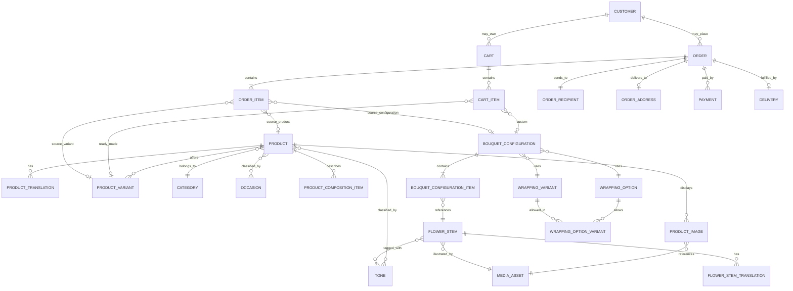

# Luméa Supabase-Ready Data Model

**Status:** Schema proposal locked for conversion into Step 9 migrations

**Database target:** PostgreSQL through Supabase

**Currency:** VND integer amounts; no floating-point money

This document is a logical schema, not executable SQL. Step 9 must translate it into versioned migrations, constraints, indexes, RLS policies, generated TypeScript types, and seed data.

## 1. Data conventions

- Core primary keys are UUIDs generated on a trusted boundary.
- Human-facing stable codes and slugs are unique, lowercase, and locale-independent.
- Money columns use integer VND amounts such as `450000`.
- Time columns use `timestamptz`; business date/cutoff calculations use the configured `Asia/Ho_Chi_Minh` timezone unless the owner changes it.
- Core mutable records have `created_at` and `updated_at`. Publishing/archiving uses `published_at` and `archived_at` where relevant.
- Translation rows use a constrained locale code beginning with `vi` and `ko`.
- Editable names never act as foreign keys.
- Ordered collections use an integer `display_order` and a deterministic UUID tie-breaker.
- Historical snapshots are immutable after Order placement.
- Product/Builder lifecycle uses visibility separately from availability.

## 2. Final proposed enums

| Enum | Values | Meaning |
|---|---|---|
| `product_type` | `READY_MADE_BOUQUET`, `FLORIST_CHOICE`, `CUSTOM_BOUQUET` | Commercial construction model. New types require an explicit migration. |
| `visibility_status` | `DRAFT`, `PUBLISHED`, `HIDDEN`, `ARCHIVED` | Whether content may be publicly exposed; not stock state. |
| `availability_status` | `AVAILABLE`, `UNAVAILABLE`, `SEASONAL` | Operational purchasability/seasonality; not publication state. |
| `cart_status` | `ACTIVE`, `CONVERTED`, `ABANDONED`, `EXPIRED` | Cart lifecycle. |
| `cart_item_type` | `READY_MADE`, `CUSTOM_BOUQUET` | Discriminates item references without parsing descriptions. |
| `order_item_type` | `READY_MADE`, `CUSTOM_BOUQUET` | Immutable item-kind snapshot. |
| `order_status` | `PENDING`, `CONFIRMED`, `PREPARING`, `READY`, `FULFILLING`, `COMPLETED`, `CANCELLED` | Commercial/fulfillment lifecycle independent of payment. |
| `payment_status` | `UNPAID`, `PENDING`, `PAID`, `FAILED`, `REFUNDED`, `CANCELLED` | Payment lifecycle independent of Order. |
| `payment_method` | `BANK_TRANSFER`, `CASH` | V1 methods. VietQR belongs to bank-transfer presentation. |
| `delivery_status` | `PENDING`, `SCHEDULED`, `READY_FOR_DISPATCH`, `OUT_FOR_DELIVERY`, `DELIVERED`, `FAILED`, `CANCELLED` | Delivery-specific lifecycle. |
| `fulfillment_type` | `DELIVERY`, `PICKUP` | Determines whether a Delivery row is required. |
| `admin_role` | `ADMIN`, `STAFF` | Minimal V1 Admin authorization model. |
| `media_access` | `PUBLIC`, `PRIVATE` | Storage/access classification. |
| `media_status` | `ACTIVE`, `ARCHIVED` | Media lifecycle without destructive deletion. |

`DRAFT`, `HIDDEN`, and `ARCHIVED` are not availability values. An entity can be `PUBLISHED + UNAVAILABLE` or `PUBLISHED + SEASONAL`.

## 3. Relationship overview

## 4. Database table proposal

### 4.1 Catalog and taxonomy

| Table / entity | Purpose | Important fields | Relationships | Admin editable? | Snapshot required? |
|---|---|---|---|---|---|
| `products` | Commercial product identity and publication state. | `id`, `stable_code`, `slug`, `type`, `category_id`, `visibility`, `availability`, `same_day_eligible`, `featured`, `bestseller`, `display_order`, timestamps. | N:1 Category; 1:N variants/images/translations/composition; M:N occasions/tones. | Yes | OrderItem stores product identity/name snapshot. |
| `product_translations` | VI/KO product copy. | `product_id`, `locale`, `name`, `short_description`, `description`, optional `seo_title`, `seo_description`. Unique `(product_id, locale)`. | N:1 Product. | Yes | Product name/copy needed for Order history is copied selectively. |
| `product_variants` | Ready-made size/offer and its explicit price. | `id`, `product_id`, `stable_code` (`standard`, `large`, `premium` initially), `price_amount`, `visibility`, `display_order`, timestamps. | N:1 Product; referenced by CartItem/OrderItem. | Yes | Variant code/name/price copied to OrderItem. |
| `product_variant_translations` | Localized variant label/description when business-managed. | `product_variant_id`, `locale`, `name`, `description`. | N:1 ProductVariant. | Yes | Name snapshot copied to OrderItem. |
| `product_images` | Ordered Product media placement. | `id`, `product_id`, `media_asset_id`, `role` (`PRIMARY`/`GALLERY`), `display_order`, `active`. | N:1 Product; N:1 MediaAsset. | Yes | Optional image key snapshot for receipts/Admin history; not required for price integrity. |
| `product_composition_items` | Ordered structured composition display. | `id`, `product_id`, optional `flower_stem_id`, `stable_key`, `display_order`, `active`. | N:1 Product; optional N:1 FlowerStem. | Yes | Localized label may be copied into Order item snapshot when operationally useful. |
| `product_composition_item_translations` | VI/KO composition labels. | `composition_item_id`, `locale`, `label`. | N:1 composition item. | Yes | As above. |
| `categories` | Stable primary catalog grouping. | `id`, `stable_code`, `slug`, `visibility`, `display_order`, timestamps. | 1:N Products; 1:N translations. | Yes | Category identity is not required for price history. |
| `category_translations` | VI/KO category copy. | `category_id`, `locale`, `name`, optional `description`. | N:1 Category. | Yes | No. |
| `occasions` | Stable shopping taxonomy. | `id`, `stable_code`, `slug`, `visibility`, `display_order`, optional `media_asset_id`, timestamps. | M:N Products through `product_occasions`. | Yes | Code/name may be copied only when selected configuration depends on it. |
| `occasion_translations` | VI/KO occasion content. | `occasion_id`, `locale`, `name`, `description`, `image_alt`. | N:1 Occasion. | Yes | Not generally required. |
| `product_occasions` | Product-to-occasion relationship. | `product_id`, `occasion_id`, optional `display_order`. Unique pair. | N:1 each side. | Yes | No; OrderItem snapshot is sufficient. |
| `tones` | Stable color/tone taxonomy and swatch. | `id`, `stable_code`, `swatch_value`, `visibility`, `display_order`. | M:N Products/FlowerStems. | Yes | Selected tone code/name copied to OrderItem. |
| `tone_translations` | VI/KO tone labels. | `tone_id`, `locale`, `name`, optional `description`. | N:1 Tone. | Yes | Selected name snapshot when used. |
| `product_tones` | Valid tone choices per Product. | `product_id`, `tone_id`, `display_order`, `active`. | N:1 each side. | Yes | Selected choice copied to Cart/Order item. |
| `budget_ranges` | Admin-managed discovery bands, not pricing logic. | `id`, `stable_code`, `min_amount`, `max_amount` nullable, `visibility`, `display_order`, optional `media_asset_id`. | Used by homepage/filter presentation. | Yes | No. |
| `budget_range_translations` | VI/KO labels and supporting copy. | `budget_range_id`, `locale`, `label`, `description`. | N:1 BudgetRange. | Yes | No. |

Rules:

- `products.slug` is globally unique and canonical for VI/KO in MVP.
- A published Product references a published Category; Category labels do not act as identity.
- `READY_MADE_BOUQUET` must have at least one published variant before Product publication.
- `FLORIST_CHOICE` also uses explicit priced variants/budget choices plus tone and occasion selections, but never individual FlowerStem selection. It uses the `READY_MADE` Cart/Order discriminator because it is a Product-backed item, not a Builder configuration.
- The Product domain exposes a base/starting price derived from its lowest or configured default published variant; it does not duplicate variant price in a second mutable Product column.
- `CUSTOM_BOUQUET` uses composed pricing from validated flower and wrapping records.
- Catalog public reads require `visibility = PUBLISHED`; availability independently controls purchase eligibility.
- Product price filters use the lowest published variant price, not stale frontend constants.

### 4.2 Builder and custom bouquet

| Table / entity | Purpose | Important fields | Relationships | Admin editable? | Snapshot required? |
|---|---|---|---|---|---|
| `flower_stems` | Builder flower inventory option. | `id`, `stable_code`, `price_per_stem_amount`, `visibility`, `availability`, `seasonal_note_required`, `display_order`, optional `media_asset_id`, timestamps. | 1:N translations/configuration items; M:N tones. | Yes | Unit price and localized name copied when configuration is locked. |
| `flower_stem_translations` | VI/KO flower name and description. | `flower_stem_id`, `locale`, `name`, `description`, `image_alt`. | N:1 FlowerStem. | Yes | Name snapshot required for Order history. |
| `flower_stem_tones` | Optional tone/color metadata. | `flower_stem_id`, `tone_id`. Unique pair. | N:1 each side. | Yes | No. |
| `wrapping_options` | Wrapping construction/type. | `id`, `stable_code`, `price_modifier_amount`, `visibility`, `display_order`, optional `media_asset_id`, timestamps. | 1:N translations and compatibility rows. | Yes | ID, name, and modifier snapshot required. |
| `wrapping_option_translations` | VI/KO wrapping type copy. | `wrapping_option_id`, `locale`, `name`, `description`. | N:1 WrappingOption. | Yes | Name snapshot required. |
| `wrapping_variants` | Color/finish/swatch shared across options. | `id`, `stable_code`, `price_modifier_amount`, `swatch_value`, `visibility`, `display_order`, optional `media_asset_id`, timestamps. | 1:N translations and compatibility rows. | Yes | ID, name, and modifier snapshot required. |
| `wrapping_variant_translations` | VI/KO color/finish name. | `wrapping_variant_id`, `locale`, `name`, optional `description`. | N:1 WrappingVariant. | Yes | Name snapshot required. |
| `wrapping_option_variants` | Database-enforced valid option/variant combinations. | `wrapping_option_id`, `wrapping_variant_id`, `active`, optional combination-level `price_modifier_amount`. Unique pair. | N:1 both wrapping tables. | Yes | Validated combination and effective modifier copied on lock. |
| `bouquet_configurations` | Structured Builder configuration used by Cart and Order. | `id`, `schema_version`, `product_id` for the configurable product, `wrapping_option_id`, `wrapping_variant_id`, trusted flower/wrapping subtotals, effective wrapping modifier snapshots, wrapping code/name snapshots in the Order locale when locked, `total_stem_count`, `total_amount`, `locked_at`, timestamps. | 1:N items; referenced by CartItem/OrderItem. | Customer-created; staff read. | The locked record itself becomes immutable history. |
| `bouquet_configuration_items` | Flower rows for a configuration. | `id`, `bouquet_configuration_id`, `flower_stem_id`, `quantity`, `unit_price_snapshot`, `line_total`, `name_snapshot`, `locale_snapshot`. Unique flower per configuration. | N:1 configuration and FlowerStem. | Customer-created through trusted service; staff read. | Yes when locked for Order. |

Builder rules:

- Quantities are positive integers and capped by the current business rule; the current UI cap is 20 per flower.
- Unavailable, hidden, or archived flowers cannot enter a new configuration.
- A wrapping pair must exist as an active `wrapping_option_variants` row.
- The browser's `BouquetBuilderResult` maps `flowers[].flowerId` to FlowerStem IDs and wrapping IDs to their records.
- On cart validation and again on Order creation, the trusted service recalculates price from current records. Client `unitPrice`, `priceModifier`, and `totalPrice` are never accepted as authoritative.
- `locked_at` is set only when Order creation succeeds. Locked configurations and items are immutable.
- A hidden FlowerStem or wrapping option remains referenced by an old locked configuration; snapshots preserve display and price history.

### 4.3 Cart and identity

| Table / entity | Purpose | Important fields | Relationships | Admin editable? | Snapshot required? |
|---|---|---|---|---|---|
| `customers` | Optional future customer profile, not required for V1 guest checkout. | `id`, optional unique `auth_user_id`, name/contact fields, timestamps. | 1:N Carts/Orders. | No routine Admin edits; protected support access only. | Orders still keep buyer snapshots. |
| `carts` | One server-side cart for guest or customer. | `id`, `status`, nullable `customer_id`, `guest_token_hash`, `currency`, `expires_at`, timestamps. | 1:N CartItems; optional N:1 Customer. | No | No; revalidated before Order. |
| `cart_items` | One discriminated item collection. | `id`, `cart_id`, `item_type`, nullable `product_id`, `product_variant_id`, `bouquet_configuration_id`, optional `tone_id`, `quantity`, `card_message`, timestamps. | N:1 Cart; conditional references by item type. | No | No; price display may be cached but not trusted. |

Cart ownership rules:

- A guest receives a high-entropy opaque token; only its hash is stored. The token is not an Order authorization mechanism.
- A future authenticated customer may own the same Cart model through `customer_id`.
- `READY_MADE` requires Product and ProductVariant and forbids BouquetConfiguration.
- `CUSTOM_BOUQUET` requires BouquetConfiguration and forbids ProductVariant; it may retain the configurable Product reference.
- Cart data is mutable and revalidated. It is never used as the historical record.
- Card message belongs to CartItem/OrderItem because multiple bouquets can carry different messages. If the owner later limits V1 to one message per Order, UI may constrain it without changing the model.

### 4.4 Orders, buyer, recipient, and address

| Table / entity | Purpose | Important fields | Relationships | Admin editable? | Snapshot required? |
|---|---|---|---|---|---|
| `orders` | Commercial aggregate and totals. | `id`, unique `order_number`, optional `customer_id`, `locale`, `status`, `fulfillment_type`, buyer name/phone/email snapshots, `is_surprise`, `currency`, `subtotal_amount`, `delivery_fee_amount`, `discount_amount` default 0, `total_amount`, `idempotency_key_hash`, `placed_at`, timestamps. | 1:N items/payments/status events; 1:1 recipient; optional 1:1 address/delivery. | Status/operational notes through validated commands. | Yes: all buyer/totals/fulfillment fields are Order-time facts. |
| `order_items` | Immutable ready-made or custom line. | `id`, `order_id`, `item_type`, nullable Product/Variant/Configuration IDs, `quantity`, `unit_price_snapshot`, `line_total`, product and variant code/name snapshots, tone snapshot, `card_message`, optional bounded `configuration_summary_snapshot`. | N:1 Order; optional source references. | No content edits after placement. | Yes. |
| `order_recipients` | Order-specific recipient snapshot. | `id`, `order_id`, `name`, `phone`, `delivery_notes`. | 1:1 Order. | Limited correction with audit event. | Yes. |
| `order_addresses` | Delivery address snapshot, not a reusable customer address. | `id`, `order_id`, `address_text`, optional `ward`, `district`, `city`, nullable source `delivery_zone_id`, `zone_name_snapshot`, `notes`. | 1:1 delivery Order; optional N:1 DeliveryZone. | Limited correction with audit event. | Yes. |
| `order_status_events` | Audit trail for valid Order transitions. | `id`, `order_id`, `from_status`, `to_status`, optional `actor_admin_id`, reason/note, `created_at`. | N:1 Order/AdminProfile. | Created only through transition command. | Event is immutable. |

Buyer and recipient are intentionally different:

- Buyer contact is snapshotted on Order because a guest may have no Customer record.
- Recipient is an Order-specific entity with the minimum required delivery contact fields.
- Address is an Order snapshot and is not silently reused as a Customer address.
- “Người nhận là tôi” copies approved buyer values into recipient fields at checkout but does not merge the entities.
- `is_surprise` is retained once on Order and is available to Delivery through its required Order relation; actual contact policy remains an owner decision.

Order number rules:

- `orders.id` is the internal UUID.
- `order_number` is a unique, human-readable, non-sequential public reference generated on a trusted boundary.
- The exact display format is an owner/implementation decision, but it must have enough entropy to prevent enumeration and is never sufficient authorization to read an Order.

### 4.5 Payment and delivery

| Table / entity | Purpose | Important fields | Relationships | Admin editable? | Snapshot required? |
|---|---|---|---|---|---|
| `payments` | Payment attempt/state independent from Order status. | `id`, `order_id`, `method`, `status`, `amount`, unique nullable `payment_reference`, nullable external/transaction reference, safe `instruction_snapshot`, `paid_at`, timestamps. | N:1 Order. | Manual status through validated command; protected settings are not edited here. | Amount/method/instructions shown at Order time. |
| `payment_status_events` | Audit trail for Payment transitions. | `id`, `payment_id`, `from_status`, `to_status`, `actor_admin_id`, reason, `created_at`. | N:1 Payment/AdminProfile. | Created through transition command. | Immutable. |
| `payment_settings` | Protected current bank/VietQR/cash configuration. | singleton/version, bank/provider fields, transfer template, cash eligibility settings, `active`, timestamps. | Read only by trusted payment operation/Admin. | Restricted Admin only. | Safe shown subset copied to Payment; secrets are never snapshotted to public data. |
| `delivery_zones` | Admin-managed service area and fee. | `id`, `stable_code`, `visibility`, `fee_amount`, optional structured ward/district rules, `same_day_eligible`, `display_order`, timestamps. | 1:N translations and Orders/Deliveries by source reference. | Yes | Name/rule/fee used are copied to Order/Delivery. |
| `delivery_zone_translations` | VI/KO zone label/help text. | `delivery_zone_id`, `locale`, `name`, `help_text`. | N:1 DeliveryZone. | Yes | Name snapshot required. |
| `delivery_windows` | Customer-visible time windows. | `id`, `stable_code`, `start_time`, `end_time`, `visibility`, `same_day_eligible`, `display_order`. | Referenced by Delivery. | Yes | Window label/time copied to Delivery. |
| `delivery_window_translations` | VI/KO window labels. | `delivery_window_id`, `locale`, `label`, optional `help_text`. | N:1 DeliveryWindow. | Yes | Label snapshot required. |
| `delivery_settings` | Current fulfillment rules. | singleton/version, `same_day_enabled`, cutoff time/timezone, capacity mode placeholder, pickup details, customer help settings, timestamps. | Used by trusted validation. | Yes | Applicable cutoff/help/pickup facts copied where needed. |
| `deliveries` | One delivery execution record for a delivery Order. | `id`, `order_id`, `status`, `delivery_date`, nullable source zone/window IDs, zone/window snapshots, `recipient_id`, `address_id`, notes, timestamps. | 1:1 Order; 1:1 recipient/address; source zone/window optional. Canonical fee and surprise flag come from Order. | Status and operational notes through commands. | Yes. |
| `delivery_status_events` | Audit trail for Delivery transitions. | `id`, `delivery_id`, `from_status`, `to_status`, `actor_admin_id`, reason, `created_at`. | N:1 Delivery/AdminProfile. | Created through transition command. | Immutable. |

There is no Delivery row for `PICKUP`. Pickup details selected at checkout are snapshotted on Order using explicit pickup fields or a small validated fulfillment snapshot defined in the Step 14 migration. Do not store arbitrary fulfillment JSON supplied by the browser.

### 4.6 Media, homepage, site content, and Admin identity

| Table / entity | Purpose | Important fields | Relationships | Admin editable? | Snapshot required? |
|---|---|---|---|---|---|
| `media_assets` | Stable identity and metadata for Storage objects. | `id`, `bucket`, `object_key`, `access`, `mime_type`, `byte_size`, width/height, checksum, `status`, uploader, timestamps. | Referenced by product/content/taxonomy/builder placement rows. | Yes through media workflow. | Object reference may be retained by historical records where useful. |
| `media_asset_translations` | VI/KO alt text and caption. | `media_asset_id`, `locale`, `alt_text`, optional `caption`. | N:1 MediaAsset. | Yes | Copy if required for an immutable receipt, otherwise no. |
| `homepage_sections` | Fixed-layout section identity and publication/order controls. | `id`, unique `section_key`, `visibility`, `display_order`, optional CTA destination type/reference, timestamps. | 1:N translations/media/product slots. | Yes for content state/order; layout remains code. | No. |
| `homepage_section_translations` | VI/KO eyebrow/title/body/CTA copy. | `homepage_section_id`, `locale`, typed text fields appropriate to the fixed section contract. | N:1 HomepageSection. | Yes | No. |
| `homepage_section_media` | Ordered/role-based section imagery. | `id`, `homepage_section_id`, `media_asset_id`, `role`, `display_order`, `active`. | N:1 section and MediaAsset. | Yes | No. |
| `homepage_product_slots` | Curated Best Seller/featured placements. | `homepage_section_id`, `product_id`, `display_order`, `active`. | N:1 section and Product. | Yes | No. |
| `gallery_items` | Managed gallery/social proof media. | `id`, `media_asset_id`, optional destination URL, `visibility`, `display_order`, timestamps. | N:1 MediaAsset; 1:N translations if captions are used. | Yes | No. |
| `site_profile` | Singleton business contact/location identity. | phone, email, address components, map URL/embed config, timezone, timestamps. | 1:N translations/hours/social links. | Yes | Selected facts may be copied to Order/payment instructions when operationally relevant. |
| `site_profile_translations` | VI/KO studio/address/help copy. | `site_profile_id`, `locale`, studio name/display address/help text. | N:1 SiteProfile. | Yes | No. |
| `business_hours` | Structured opening hours. | weekday, open/closed, open time, close time, display order. | N:1 SiteProfile. | Yes | No. |
| `social_links` | Ordered social/contact destinations. | `id`, `platform`, `url`, `active`, `display_order`. | N:1 SiteProfile. | Yes | No. |
| `admin_profiles` | App authorization profile linked to Supabase Auth. | `id`, unique `auth_user_id`, `role`, `active`, display name, timestamps. | 1:N status/media/audit events. | Only ADMIN manages staff access. | No. |
| `admin_activity_log` | High-value Admin change audit. | `id`, `actor_admin_id`, `action`, `entity_type`, `entity_id`, safe change summary, `created_at`. | N:1 AdminProfile. | System-created, read by ADMIN. | Immutable. |
| `custom_requests` | Florist-led bespoke request, distinct from Builder configuration. | `id`, public-safe reference, `status` initially `PENDING`, contact fields approved later, occasion/budget/tone/preferences/avoid/message/delivery date, timestamps. | Optional private MediaAsset reference; Admin-only reads. | Staff status/notes after policy approval. | Submission is historical input. |

Homepage section translation fields remain typed per fixed section contract. This avoids both extremes: one table per sentence and one unconstrained page-sized JSON blob. Layout variants, grids, animation, and component selection remain in React code.

## 5. OrderItem snapshot strategy

### Ready-made OrderItem

Persist:

- Source Product and ProductVariant UUIDs when records still exist.
- Product stable code and canonical slug at purchase time.
- Product name snapshot in the Order locale.
- Variant code and name snapshot in the Order locale.
- Selected tone stable code/name snapshots where applicable.
- Quantity, `unit_price_snapshot`, and `line_total`.
- Card message and approved item-level notes.

### Custom Bouquet OrderItem

Persist:

- `item_type = CUSTOM_BOUQUET`.
- Source configurable Product UUID and locked BouquetConfiguration UUID.
- Configuration schema version.
- Every FlowerStem UUID, quantity, unit price snapshot, name/locale snapshot, and line total in child rows.
- Wrapping option/variant UUIDs, stable codes, name/locale snapshots, and each effective price modifier snapshot.
- Total stems, flower subtotal, wrapping subtotal, and total amount.
- Card message and approved notes.

Order screens must never reconstruct historical names or prices only from current catalog rows. Stable references enable traceability; snapshots enable durability.

## 6. Trusted price and Order creation

1. Load the active Cart and lock it for the creation attempt.
2. Validate guest/customer ownership and the idempotency key.
3. Reload Product, Variant, Tone, FlowerStem, wrapping compatibility, availability, and visibility.
4. Validate delivery/pickup, date, window, same-day cutoff, zone, and current fee.
5. Recalculate each line with integer arithmetic.
6. Build item, configuration, buyer, recipient, address, delivery-fee, and payment-instruction snapshots.
7. Create Order, OrderItems, Payment, Delivery when applicable, and initial status events in one database transaction.
8. Mark Cart `CONVERTED` only when the transaction succeeds.
9. Return the authoritative Order number, totals, Order status, and Payment status.

If the current total differs from the user's review, the trusted operation returns a price/availability change response for explicit customer confirmation; it does not silently accept the client total.

## 7. State transitions

### Order

Main path:

`PENDING → CONFIRMED → PREPARING → READY → FULFILLING → COMPLETED`

Rules:

- `PENDING → CANCELLED` is allowed.
- Later cancellation paths require owner policy and a reason; they are not inferred from Payment failure.
- `READY → COMPLETED` is allowed for confirmed pickup.
- Delivery `DELIVERED` can permit, but should not silently force, Order `COMPLETED` until the operational rule is approved.
- No backward transition occurs by editing a row directly; correction uses an explicit authorized command and event.

### Payment

- Bank transfer: `UNPAID → PENDING → PAID`; `PENDING → FAILED` or `CANCELLED`; `PAID → REFUNDED` only through an approved manual process.
- Cash: may remain `UNPAID` while Order is confirmed; it becomes `PAID` only at the owner-approved collection moment.
- Payment status never confirms or cancels an Order automatically in V1.

### Delivery

`PENDING → SCHEDULED → READY_FOR_DISPATCH → OUT_FOR_DELIVERY → DELIVERED`

- Active delivery states may move to `FAILED` or `CANCELLED` with a reason.
- Retry/re-schedule policy remains an owner decision and, if added, records a new event rather than overwriting history.

## 8. Constraint and index checklist for Step 9

- Unique: Product slug/stable code, taxonomy stable codes, Builder stable codes, Order number, active guest token hash, Payment reference, translation `(entity_id, locale)`, and compatibility pairs.
- Checks: all money and quantity fields are non-negative; ordered bounds are valid; Order totals equal component totals; item references match discriminator; delivery presence matches fulfillment type.
- Foreign keys: explicit `RESTRICT` for referenced active/history-critical rows; `SET NULL` only when snapshots make the record independently readable.
- Indexes: published/display order, Product filters, slug, translation locale, Cart ownership/status/expiry, Order number/status/date, Payment status, Delivery status/date, and all foreign keys used in Admin lists.
- Concurrency: Order creation and status transitions use transactions and expected-current-status checks.
- Immutability: database policy/trigger or trusted-command restriction prevents edits to placed Order snapshots and locked bouquet configurations.
- Public query shape: expose safe views or repository queries rather than granting public access to whole tables.

## 9. Retention and deletion

- Hide or archive business content instead of hard-deleting it.
- A hidden Product/FlowerStem disappears from new storefront choices but remains traceable from old Orders.
- Unordered drafts, expired carts, and unused unlocked configurations may be cleaned after an approved retention window.
- Orders, buyer/recipient/address data, private uploads, and audit events follow a future privacy/legal retention policy.
- Media objects are deleted only after reference checks, retention approval, and safe orphan cleanup.

## 10. Deliberately deferred decisions

- Exact PostgreSQL enum versus lookup-table implementation; Step 9 should prefer database enums only for stable, low-churn states listed in section 2.
- Exact Order number format.
- Size-pricing and seasonal-purchase rules.
- Delivery zones, cutoff/capacity, guaranteed versus preferred windows, and pickup behavior.
- Surprise contact, cash collection, cancellation/refund, and retention policies.
- Custom-request workflow beyond `PENDING`.
- Image ratios, byte limits, derivative policy, and moderation.

These decisions must be resolved before their dependent implementation slice, but the schema boundaries above remain valid.
